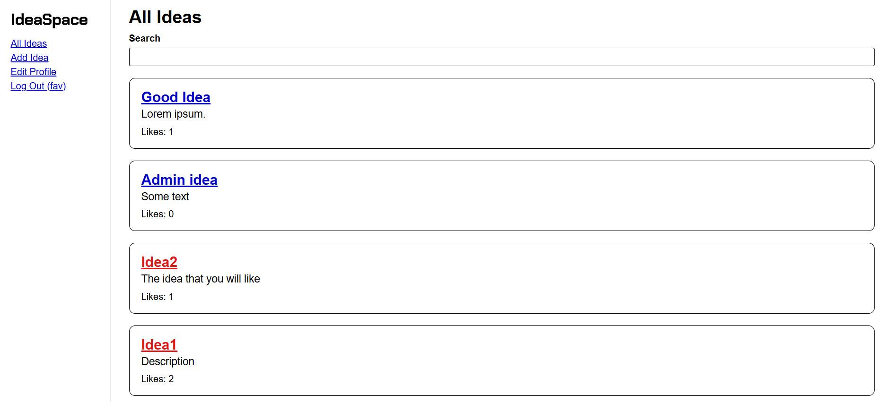
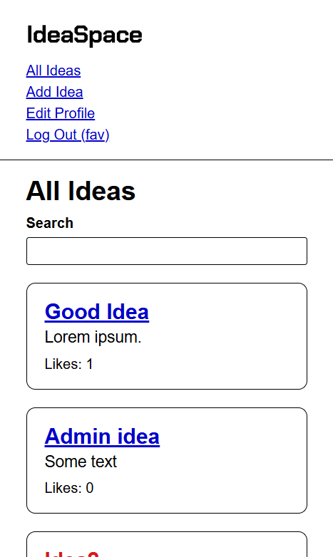

# IdeaSpace Full-Stack Application

A modern platform for sharing, exploring, and supporting creative ideas. Users can post new ideas, like others’ submissions, maintain personal profiles, and engage in an evolving idea ecosystem.

### Features

- **Idea Creation** — Create and publish your own ideas with structured metadata.
- **Idea Discovery & Likes** — Browse other users’ ideas and show appreciation via likes.
- **User Profiles** — View and manage your public profile and activity.
- **Authentication** — Secure JWT-based user authentication with Passport.
- **Email Notifications** — Automated transactional emails via SendGrid.
- **Media Uploads** — Store and serve images through AWS S3 or Cloudinary.
- **Analytics** — Integrated Mixpanel tracking for user interactions.
- **Error Monitoring** — Full Sentry integration for backend and frontend.
- **Typed End-to-End Communication** — TRPC-based shared types between backend and frontend.
- **Monorepo Architecture** — Shared TypeScript codebase managed via PNPM workspaces.
- **Dockerized Deployment** — Configurable through Docker Compose for local and cloud environments.
- **Heroku Container Deployment** — Build and release pipeline through Heroku’s container registry.

### Links

- Code URL: (https://github.com/agneja00/Idea_Space)
- Live Site URL: (https://ideaspace-4fcd43ee8a12.herokuapp.com/)

### Project Structure

ideanick/
├── backend/ # Express + TRPC API, Prisma ORM, authentication, storage, email
├── frontend/ # React + Vite + TRPC client + React Query + Zod validation
├── shared/ # Common TypeScript types and schemas
└── package.json # Root scripts, linting, Docker & Heroku utilities

### Built With

- **Frontend**: React 19, Vite, TypeScript, React Query, Zod, Formik, Sass
- **Backend**: Node.js, Express 5, TRPC, Prisma, JWT, Passport, SendGrid, AWS SDK, Cloudinary
- **DevOps**: Docker, Heroku, dotenv-cli, concurrently
- **Tooling**: ESLint, Prettier, Jest, Husky, PNPM Workspaces
- **Monitoring**: Sentry, Mixpanel
- **Database**: PostgreSQL (via Prisma ORM)

### Deployment

1. Build Docker images with environment variables via `.env.docker`.
2. Push to Heroku container registry using `pnpm dth`.
3. Release build with `pnpm hr`.

## Author

- Website - [Agnieska Jackevic] (https://web-portfolio-agneja00.vercel.app/)
- Linkedin - [Agnieska Jackevic] (https://www.linkedin.com/in/agnieska-jackevic/)

